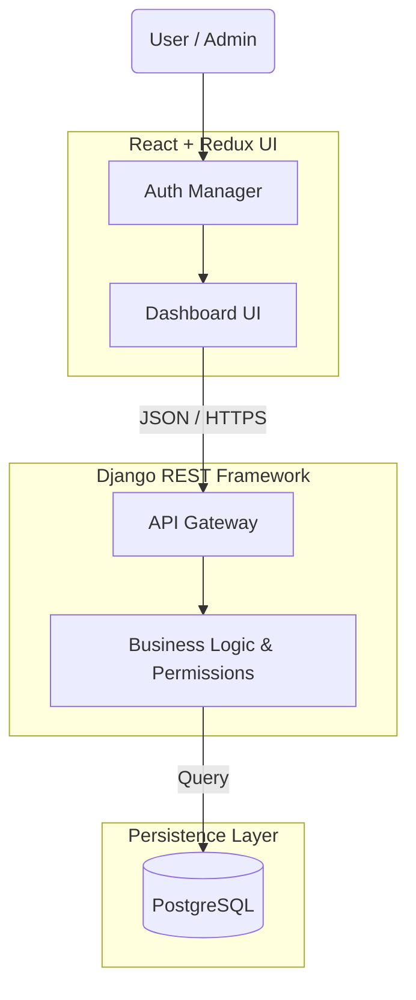

  

  <b>"I don't just write code. I architect resilient systems that aim to solve business problems."</b>

  
  
  
  
  

---

### 🌉 The Business-Tech Bridge

My foundation isn't just code, it's **Crisis Management**.
Managing real-world business challenges, like critical transitions in my family's electronics business, taught me invaluable lessons:
*   ⏳ **Downtime has real costs.** Every minute counts.
*   🛡️ **Systems must be resilient.** They must endure and adapt.
*   🎯 pragmatism is key. Focus on what works, efficiently.

This **operational pragmatism** shapes my approach to software development. I don't just build features; I architect **reliable, resilient systems** that directly solve business problems.

---

### 🛠️ My Toolkit

I focus on **getting things done**. I use modern tools to build fast, scalable, and user-friendly applications.

  <h4 align="center">The Logic (Backend)</h4>
  

    
  

  <h4 align="center">The Look (Frontend)</h4>
  

    
  

  <h4 align="center">The Workflow</h4>
  

    
    
  

---

### 🧠 The Architecture of My Work 🏗️

I think in **Systems**, not just scripts. Here is the architectural logic behind my flagship project, **HomeSer**:

> **Why this matters:** This separation of concerns ensures that the frontend is purely a consumer of data, allowing the backend to serve multiple clients (web, mobile, CLI) without refactoring logic.

---

### 🤖 My AI-Native Workflow (Human-in-the-Loop)

I am an **AI-Augmented Developer**. I use AI not to think _for_ me, but to execute _with_ me.

| Stage         | 👤 Human Responsibility (Me)                                              | 🤖 AI Responsibility (The Tool)                                  |
| :------------ | :------------------------------------------------------------------------ | :--------------------------------------------------------------- |
| **1. ✨ Design** | Define the **Schema**, **Data Relationships**, and **Business Rules**.    | Suggest optimization patterns or alternative libraries.          |
| **2. 🏗️ Build**  | Implement **Core Logic**, **Security Constraints**, and **Architecture**. | Generate boilerplate, type definitions, and repetitive CRUD ops. |
| **3. 🔍 Polish** | Review code for **Maintainability** and **Edge Cases**.                   | Write Unit Tests and generate Docstrings.                        |

> _Result: The whole process is streamlined and efficient._

---

### 🚀 Key Projects ✨

| Project                                                                                                                                                                  | The Engineering Challenge                                                                                                                                                                                                    |
| :----------------------------------------------------------------------------------------------------------------------------------------------------------------------- | :--------------------------------------------------------------------------------------------------------------------------------------------------------------------------------------------------------------------------- |
| **🠠HomeSer** _Service Marketplace_  🔗 [Live Demo](https://homeser-frontend-react.vercel.app/) • 💾 [Repo](https://github.com/MushfiqPlabon/homeser-frontend-react) | 💡 **Challenge:** Managing complex state between Admin and Client roles. ✅ **Solution:** Implemented a strict **Role-Based Access Control (RBAC)** in Django middleware, ensuring data integrity regardless of frontend state. |
| **🎟️ EventMan** _Event Booking System_  🔗 [Live Demo](https://event-man-drab.vercel.app/) • 💾 [Repo](https://github.com/MushfiqPlabon/EventMan)                     | 💡 **Challenge:** Delivering a "Native App" feel on the mobile web without heavy JS bundles. ✅ **Solution:** Leveraged **HTMX** to swap HTML fragments server-side, reducing Time-To-Interactive (TTI) drastically.            |

---

### 🌍 Philosophy: "Knowing for the sake of Knowing" & Human-Centric Systems

📚 Inspired by **Dr. Roy Casagranda**, my curiosity isn't just academic; it's a boundless drive to understand **how systems impact people**, no matter the field. I delve into **any subject that piques my interest**, from history and geology to psychology and complex networks; because each reveals universal principles of structure, interaction, and resilience that I apply directly to software.

💖 As an **Idealist (INFP-T)**, I'm driven by an intense desire for knowledge and a profound empathy for the world's challenges. My work is grounded in a deep sense of **Stewardship**, a belief that we must be worthy caretakers of our world, striving to serve everyone and everything with integrity. This spiritual foundation fuels my commitment to building technology that genuinely solves human problems, enhances efficiency, and respects the user's experience. My work isn't just about code; it's about creating thoughtful, sustainable systems that contribute positively to the "real world" I've experienced firsthand.

---

### ⚡ Activity

<!--START_SECTION:activity-->
<!--END_SECTION:activity-->

  
  

  

